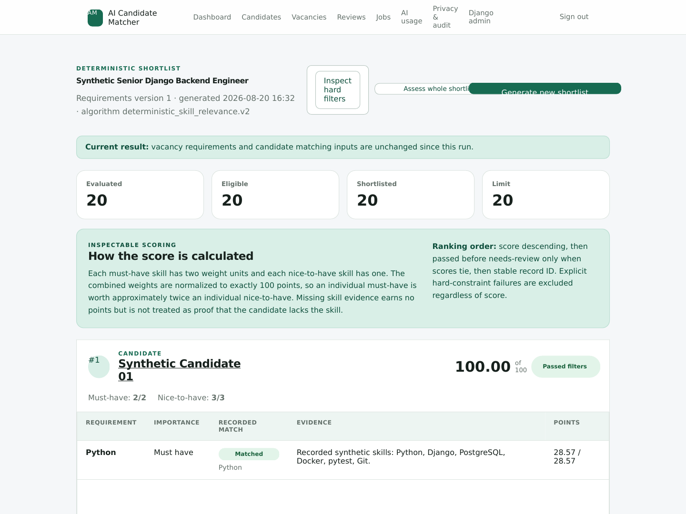
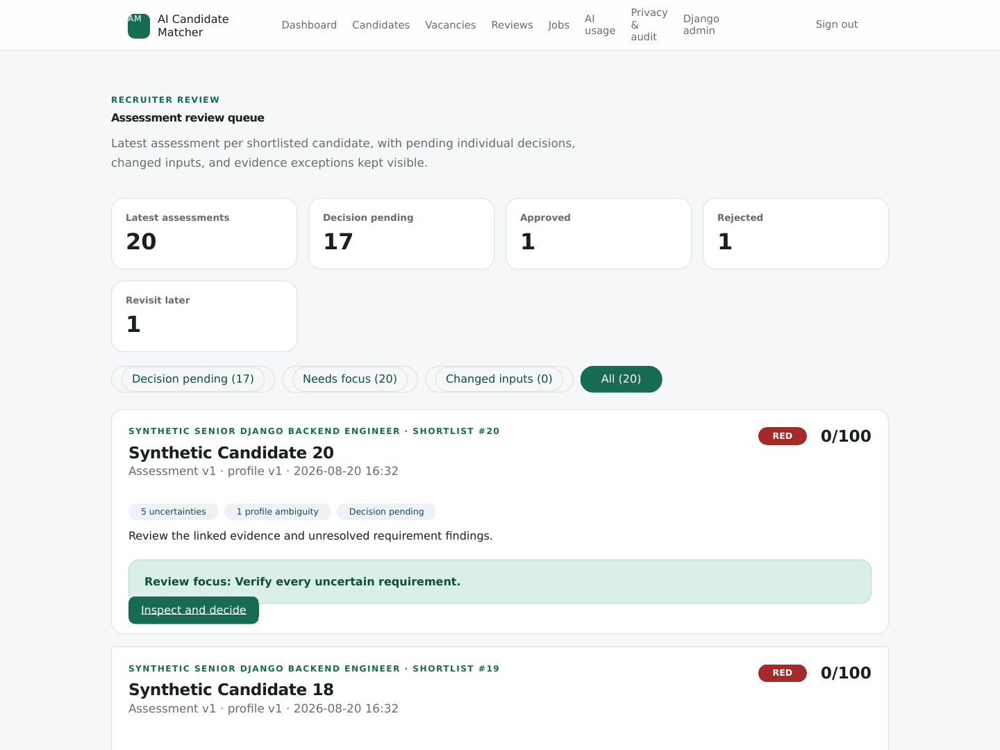
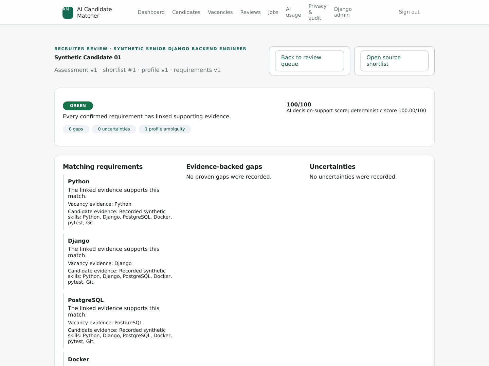
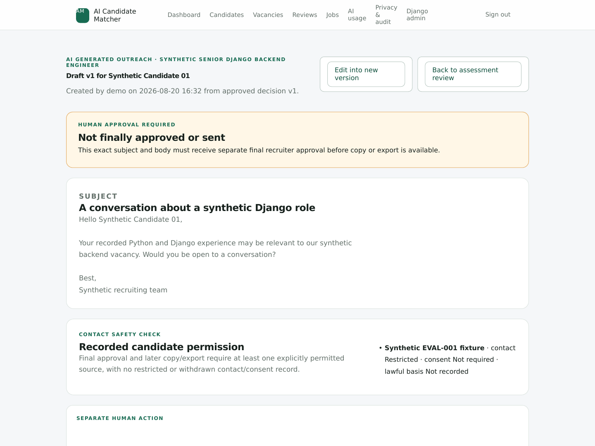

# Reproducible Synthetic Demo

This walkthrough creates a complete, isolated product demonstration from the
version-controlled EVAL-001 fixture. Every person, vacancy, CV, and statement is
invented. The setup makes no provider or network request and needs no AI key.

The fixture demonstrates workflow behavior, not live-model quality. It uses the
normal application assessment, decision, and outreach services with validated,
deterministic provider-free responses. Use EVAL-002 and EVAL-003—not this demo—to
measure ranking or explanation quality.

## Prepare the demo

From PowerShell in the project root:

```powershell
uv sync --extra dev --locked
if (-not (Test-Path .env)) { Copy-Item .env.example .env }
uv run python manage.py migrate
uv run python manage.py createsuperuser
uv run python manage.py prepare_demo --username admin --organization-slug synthetic-demo-001
uv run python manage.py runserver
```

Replace `admin` with the username you created. The command refuses to overwrite
an existing organization; use a new slug when repeating the demo.

The command prints exact local routes and creates:

- 20 candidates with private generated DOCX CVs and confirmed reusable profiles;
- 3 open vacancies and 3 verified deterministic shortlists;
- 20 current evidence-linked assessments for the V01 Django shortlist;
- 3 individual human-attributed decisions: approve, revisit, and reject; and
- 1 inspectable outreach draft tied to the approved assessment.

It creates no final outreach approval, copy/export event, or send action. Every
synthetic source remains contact-restricted, so the draft page visibly blocks
final approval even though the candidate decision is approved.

## Five-minute walkthrough

1. Open the printed **Dashboard** route and confirm 20 active candidates and 3
   open vacancies.
2. Open **Shortlist**. Point out the current-input label, deterministic 2:1 skill
   weighting, exact candidate evidence, and the separate AI assessment score.
3. Open **Review queue** with `?scope=all`. Show 20 latest assessments, 17
   pending decisions, and one each approved, rejected, and revisit. Switch to
   **Needs focus** to demonstrate exception-oriented review without hiding
   routine entries.
4. Open **Approved assessment**. Inspect the linked requirement/evidence details
   and immutable recruiter decision history. The decision remains individual and
   does not change the score or automatically contact anyone.
5. Open **Unapproved outreach draft**. Show that the exact draft is inspectable,
   still requires separate final approval, and cannot be approved or copied
   because contact permission is restricted. Nothing is sent by the application.

## Reference screenshots

The images below were captured at 1440 × 1080 from the authenticated Django
pages produced by the packaged synthetic fixture and the repository CSS.

### Inspectable deterministic shortlist



### Compact recruiter review queue



### Individual evidence-linked assessment



### Separate blocked outreach approval



## Refresh the screenshots

Run the preparation command with a new organization slug, start Django, sign in,
and capture the four printed routes above at a 1440 × 1080 browser viewport.
Keep `?scope=all` on the review queue. Save the resulting PNG files under
`docs/demo/screenshots/` using the existing names. Verify each image contains
only `Synthetic Candidate` fixture records and that the outreach image still
says both **Not finally approved or sent** and **Final approval is unavailable**.

Do not capture real candidate data, a configured provider key, `.env`, terminal
secrets, private storage paths, or an organization that contains non-fixture
records.

## Reset or repeat safely

The preparation command deliberately has no destructive reset flag. For another
run, choose a fresh slug such as `synthetic-demo-002`. Delete the disposable
SQLite database and local `media/` directory only under the guarded local-reset
procedure in `docs/manual_testing_guide.md`; never do so in a shared or valuable
environment.
